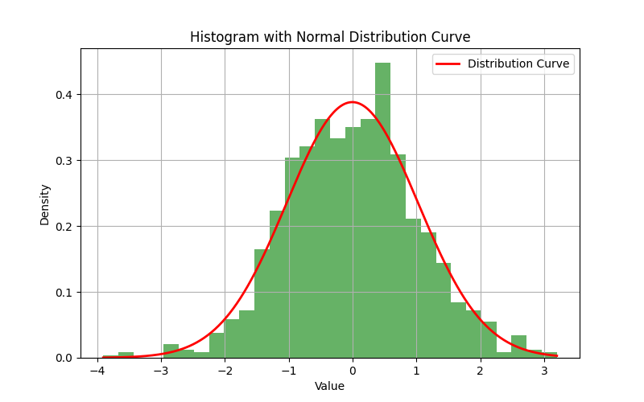

### Task 3 Discussion
Mean: -0.00, Median: 0.01, Standard 
Deviation: 1.03, Min: -3.9069928457536056, Max: 3.201643581309131, Q1: -0.7264379983246221, Q3: 0.6624367580166216
| Data ||
| -------- | ------- |
| Mean | -0.00  |
| Median | 0.01 |
| Standard Deviation | 1.03 |
| Min | -3.9069928457536056 |
| Max | 3.201643581309131 |
| Q1 | -0.7264379983246221 |
| Q3 | 0.6624367580166216 |
| IQR | -1.388874756341244 |

The histogram shows that the data is fairly symetrical around the mean since the mean was generated at 0 and the standard devieation at 1. As the data is randomly generated the median and mean are close together with the mean slightly higher or lower. This means that there is very little skew in the data showiing signs of normal distribution. The histogram also shows that the data is normally distributed as the data is symetrical around the mean. With the fitted normal distribution curve the data fits very well within the curve leaving very little data deviation outside. Overall the sample is a good exmple to a normal distribution of data.

