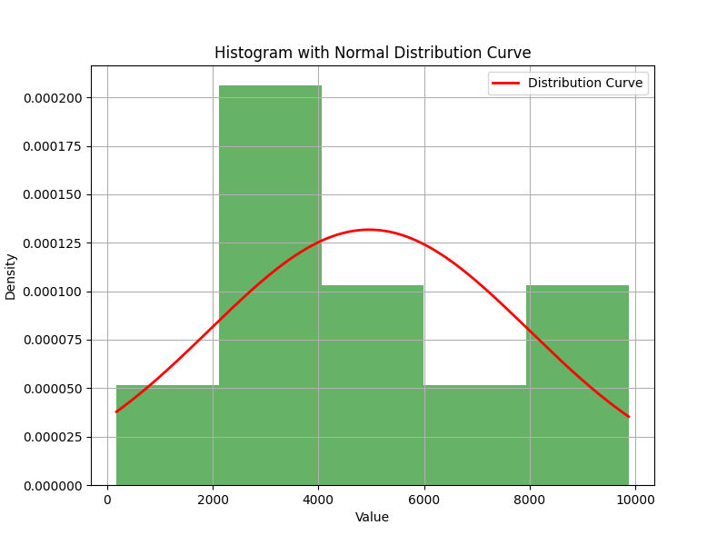

### Task 3.5 Discussion

| Data ||
| -------- | ------- |
| Mean | 4961.70  |
| Median | 4108.00 |
| Standard Deviation | 3027.66 |
| Min | 178 |
| Max | 9876 |
| Q1 | 2872.5 |
| Q3 | 7388.5 |
| IQR | 4516.0 |

The data shows a slightly skewed distribution, this is shown by the difference between the mean and the median. Since the mean is higher than the median, this suggests a positive skew. The standard deviation is fairly high, causing the data points to be widely spread out from the mean. The data does not fit a normal distribution as shown in the image below, however it shows some characteristics of a symmetrical spread. This may be down to the amount of data included.  Overall, while the data is not perfectly normally distributed, it appears to be moderately close, with some deviation due to skewness.

